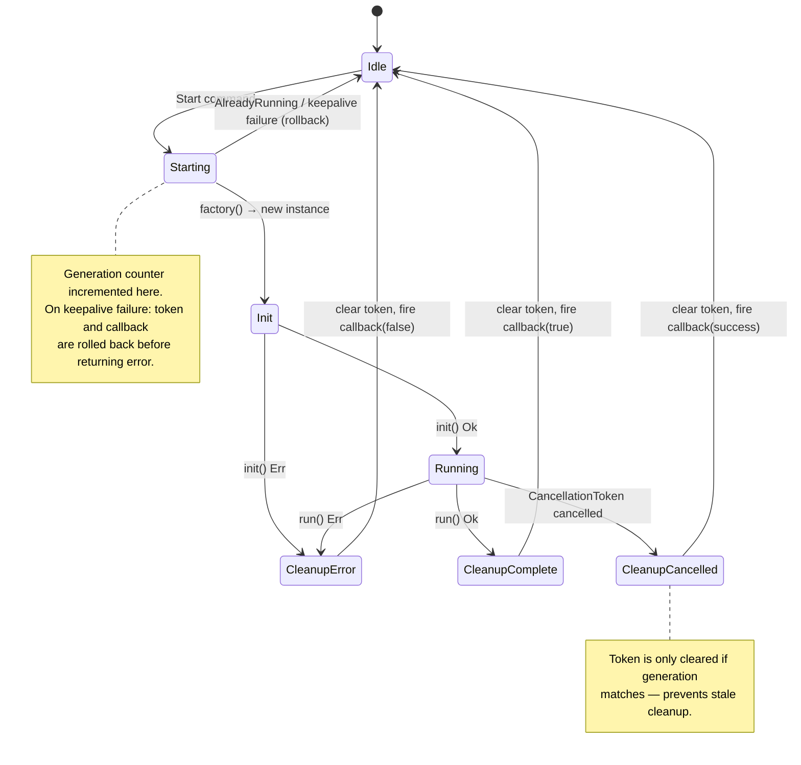
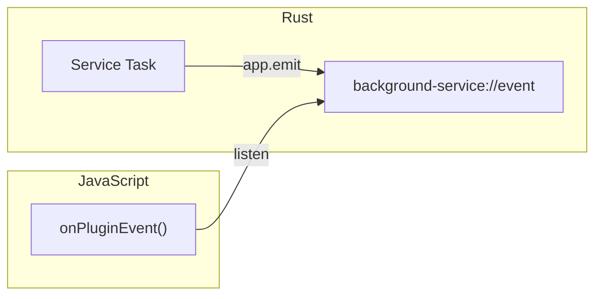

# Architecture

This document describes the internal design of `tauri-plugin-background-service`. It is intended for contributors and advanced users who need to understand how the plugin works under the hood.

## Design Philosophy

The plugin has exactly three responsibilities:

1. **Lifecycle management** — start, stop, and track the running state of a single background service. The plugin does not impose any business logic on what the service does; it only manages *when* it runs and *how* it shuts down.

2. **OS keepalive** — keep the service alive when the OS would otherwise suspend or kill it. This takes different forms on each platform: a foreground service on Android, a `BGAppRefreshTask` on iOS, and nothing extra on desktop (where `tokio::spawn` is sufficient).

3. **Helpers** — convenience types that service implementations need: a `Notifier` for local notifications, a `CancellationToken` for cooperative shutdown, and typed `PluginEvent`s for the JS layer.

Everything else is the user's responsibility. The plugin does not provide retry logic, scheduling, persistence, or inter-service coordination.

## Component Map

```
tauri-plugin-background-service/src/
├── lib.rs              Plugin entry point, Tauri commands, iOS helpers
├── manager.rs          Actor loop, command handlers, MobileKeepalive trait
├── models.rs           StartConfig, PluginConfig, PluginEvent, ServiceContext
├── error.rs            ServiceError enum
├── service_trait.rs    BackgroundService<R> trait
├── notifier.rs         Notifier wrapper over tauri-plugin-notification
└── mobile.rs           MobileLifecycle: Rust→Kotlin/Swift bridge
```

```mermaid
graph TD
    JS["JavaScript (guest-js)"] -->|invoke| CMD["Tauri Commands<br/>(lib.rs)"]
    CMD -->|mpsc::Sender| ACTOR["Actor Loop<br/>(manager.rs)"]
    ACTOR -->|factory()| SVC["Service Task<br/>(init → run)"]
    ACTOR -->|MobileKeepalive trait| MOBILE["MobileLifecycle<br/>(mobile.rs)"]
    MOBILE -->|run_mobile_plugin| NATIVE["Native Layer<br/>(Kotlin / Swift)"]
    SVC -->|emit| EVT["PluginEvent<br/>(background-service://event)"]
    EVT -->|listen| JS

    TRAIT["BackgroundService&lt;R&gt;<br/>(service_trait.rs)"] -.->|implemented by| SVC
    MODELS["Models<br/>(models.rs)"] -.->|ServiceContext, StartConfig| ACTOR
    MODELS -.->|PluginEvent| EVT
    ERROR["ServiceError<br/>(error.rs)"] -.-> ACTOR
    NOTIF["Notifier<br/>(notifier.rs)"] -.->|ServiceContext.notifier| SVC
```

## Actor Pattern

The core concurrency model is a single-owner **actor loop** (`manager_loop` in `manager.rs`). All state mutations go through a Tokio `mpsc` channel, so there is exactly one task that can modify the service state at any time.

```mermaid
sequenceDiagram
    participant JS as JavaScript
    participant Cmd as Tauri Command
    participant Actor as manager_loop
    participant Task as Service Task

    JS->>Cmd: startService(config)
    Cmd->>Actor: ManagerCommand::Start { config, reply }
    Actor->>Actor: Check AlreadyRunning
    Actor->>Actor: Create CancellationToken, increment generation
    Actor->>Actor: start_keepalive (mobile only)
    Actor->>Task: spawn (init → run)
    Actor-->>Cmd: reply Ok(())
    Cmd-->>JS: Promise resolves

    Note over Task: init() runs
    Task-->>JS: emit PluginEvent::Started

    Note over Task: run() executes until cancelled or done

    JS->>Cmd: stopService()
    Cmd->>Actor: ManagerCommand::Stop { reply }
    Actor->>Actor: token.cancel()
    Actor->>Actor: stop_keepalive (mobile only)
    Actor-->>Cmd: reply Ok(())
    Cmd-->>JS: Promise resolves

    Note over Task: run() returns via tokio::select!
    Task->>Task: Cleanup: clear token, fire callback, emit event
    Task-->>JS: emit PluginEvent::Stopped
```

### Initialization Flow

`init_with_service(factory)` in `lib.rs`:

1. Creates an `mpsc::channel(16)` for `ManagerCommand` messages.
2. Constructs a `ServiceManagerHandle` (wraps the sender) and stores it as Tauri managed state.
3. Spawns the `manager_loop` task with the receiver, factory, and iOS safety timeout.
4. On mobile (`#[cfg(mobile)]`): calls `mobile::init()` to get a `MobileLifecycle`, wraps it as `Arc<dyn MobileKeepalive>`, and sends `SetMobile` to the actor.
5. On Android: checks for auto-start flags from `SharedPreferences` (set by `LifecycleService` after OS-initiated restart) and sends `Start` if found.

### Command Handling

The actor receives `ManagerCommand` variants and dispatches:

| Command | Handler | Description |
|---------|---------|-------------|
| `Start` | `handle_start` | Rejects if `AlreadyRunning`. Creates token, increments generation, starts keepalive, spawns service task. |
| `Stop` | `handle_stop` | Cancels the token, stops keepalive. Returns `NotRunning` if idle. |
| `IsRunning` | inline | Checks if `token` slot is `Some`. |
| `SetOnComplete` | inline | Stores callback for capture at next spawn. |
| `SetMobile` | inline | Stores `Arc<dyn MobileKeepalive>` for mobile keepalive. |

## Service Lifecycle

Each start creates a fresh service instance via the factory and runs it through two phases:



### Phase 1: init()

Called once with a `ServiceContext`. Use this for setup that requires the Tauri context — opening database connections, registering event listeners, etc. If `init()` fails, the `Error` event is emitted, the token is cleared, and the `on_complete` callback fires with `false`.

### Phase 2: run()

The main service loop. Implementations **must** use `tokio::select!` with `ctx.shutdown.cancelled()` to support cooperative cancellation:

```rust,ignore
async fn run(&mut self, ctx: &ServiceContext<R>) -> Result<(), ServiceError> {
    tokio::select! {
        _ = ctx.shutdown.cancelled() => Ok(()),
        result = self.do_work() => result,
    }
}
```

When `run()` completes (success, error, or cancellation), the spawned task:
1. Clears the token slot (if generation matches).
2. Emits `PluginEvent::Stopped` (success) or `PluginEvent::Error` (failure).
3. Fires the `on_complete` callback with `true` (success) or `false` (error/cancel).

## Event Flow

Events flow from the service task to the JavaScript layer via Tauri's event system:



### Event Types

| Event | Trigger | Payload |
|-------|---------|---------|
| `Started` | `init()` succeeded | `{ type: "started" }` |
| `Stopped` | `run()` returned `Ok(())` | `{ type: "stopped", reason: "completed" }` |
| `Error` | `init()` or `run()` returned `Err` | `{ type: "error", message: "..." }` |

Events use a tagged JSON format (`#[serde(tag = "type")]`) with `camelCase` field names.

## Key Design Decisions

### 1. Actor pattern for state serialization

**Decision:** All mutable state lives in `ServiceState`, owned exclusively by `manager_loop`. Commands are sent through an `mpsc` channel.

**Rationale:** A single-owner actor serializes all state mutations without requiring `async`-compatible locks. This prevents start/stop interleaving bugs where concurrent `Start` commands could race on the token slot. The channel also provides natural backpressure — if the actor is busy, commands queue up rather than corrupting state.

### 2. Generation counter for race-condition safety

**Decision:** An `AtomicU64` counter is incremented on every `Start`. The spawned task captures `my_gen` at spawn time and checks `gen_ref.load() == my_gen` before clearing the token during cleanup.

**Rationale:** After a `Stop` → `Start` sequence, the old task and the new task both hold references to the shared `token` slot. Without the generation guard, the old task's deferred cleanup could clear the new task's token, leaving the service in an inconsistent state. The counter ensures that only the task matching the current generation can modify the slot.

### 3. Object-safe trait via `#[async_trait]`

**Decision:** `BackgroundService<R>` uses the `async_trait` macro, which transforms `async fn` into `Pin<Box<dyn Future>>`. This allows `Box<dyn BackgroundService<R>>`.

**Rationale:** The factory pattern (`ServiceFactory<R> = Box<dyn Fn() -> Box<dyn BackgroundService<R>>>`) requires type erasure. Without `async_trait`, async methods are not object-safe because `async fn` desugars to an associated type (the `impl Future`), which cannot be used through `dyn`. The macro trades a small heap allocation per call for the ability to store and dispatch services dynamically.

### 4. Factory pattern for fresh instances

**Decision:** `init_with_service` takes `Fn() -> S` (a closure that creates a new service). Each `Start` call invokes the factory to produce a fresh `Box<dyn BackgroundService<R>>`.

**Rationale:** Services carry mutable state during `init` and `run`. Reusing the same instance across start/stop cycles would leak state from the previous run. The factory guarantees a clean slate for every start, while the `Box<dyn>` erasure keeps the plugin generic over any concrete service type.

### 5. CancellationToken for cooperative shutdown

**Decision:** The actor creates a `tokio_util::sync::CancellationToken` on `Start`, shares a clone with the service task via `ServiceContext.shutdown`, and calls `token.cancel()` on `Stop`.

**Rationale:** `CancellationToken` is a lightweight, single-operation barrier. It integrates naturally with `tokio::select!`, allowing services to respond to shutdown without polling a flag or wrapping every operation in a timeout. This is the only supported shutdown path — there is no `AbortHandle` or `JoinHandle::abort()`.

### 6. MobileKeepalive abstraction in manager.rs

**Decision:** The `MobileKeepalive` trait is defined in `manager.rs` (not behind `#[cfg(mobile)]`), so the actor references it on all platforms. On desktop, `ServiceState.mobile` is `None` and the trait methods are never called.

**Rationale:** Conditional compilation (`#[cfg(mobile)]`) on the trait itself would require duplicating the `handle_start` / `handle_stop` logic with and without mobile branches, or wrapping every call site in `#[cfg]`. By defining the trait unconditionally and using `Option<Arc<dyn MobileKeepalive>>`, the actor code is identical across platforms — mobile behavior is selected by the presence of the handle, not by compile-time features.

### 7. Rollback on keepalive failure

**Decision:** If `start_keepalive()` fails during `handle_start`, the token slot is cleared and the `on_complete` callback is restored to its pre-start state before returning the error.

**Rationale:** `handle_start` modifies three pieces of state: the token slot, the generation counter, and the callback slot. The generation counter is harmless to increment (it only grows). But the token and callback represent allocated resources — leaving a dangling token would make `IsRunning` return `true` for a service that never started, and losing the callback would silently break iOS `completeBgTask`. Rollback ensures the actor returns to a clean idle state on failure.
